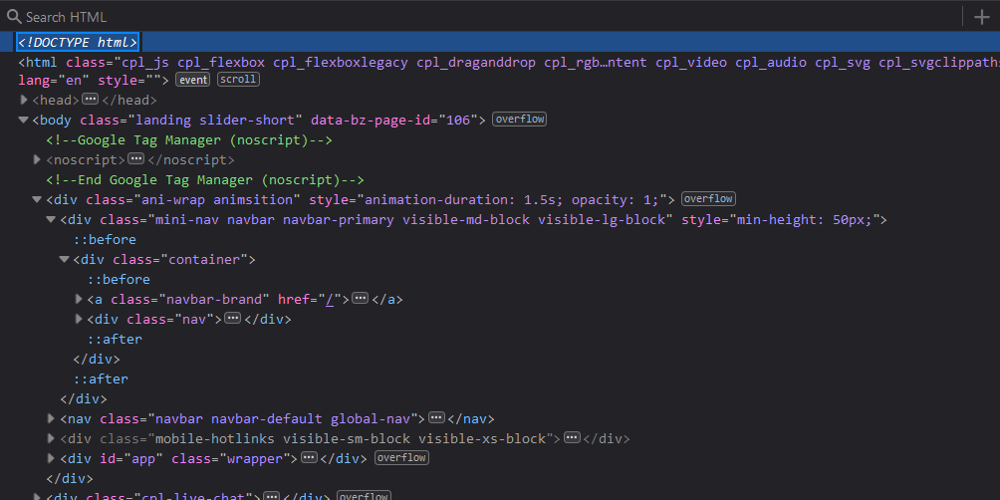
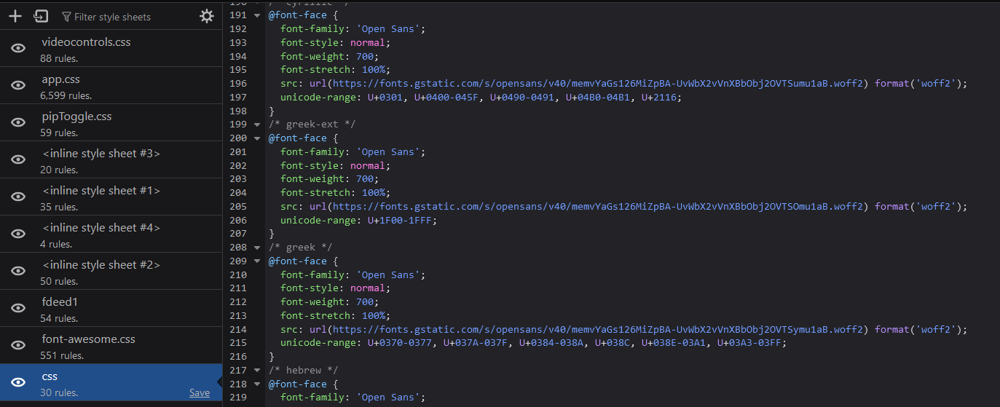
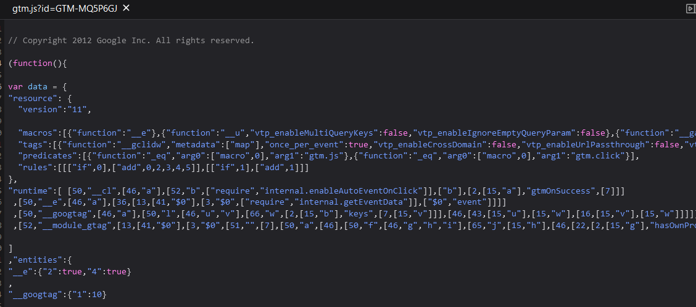
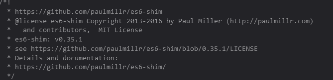

**Inspecting the Web**

When inspecting the web, I came across the Champaign Public Library, which can be found here: https://champaign.org/ 

I came across many instances of HTML, which was used to build the visual structure of the website. 

I also came across CSS, which was used to give the website style and a layout. 

I also came across javascript, which was used to give the website some interaction and create things like interactable buttons. 

Who built this website? 

This seems to be build by Paul Miller. I tried looking into their git but it said that it was emplty, so I am assuming that he is one of or the main one that completed this project. 
